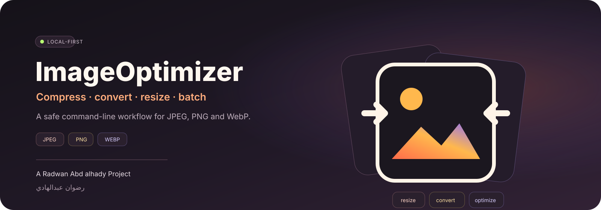
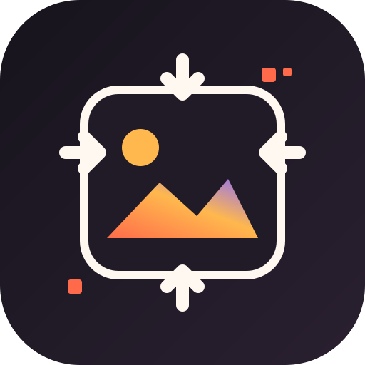

 

# ImageOptimizer

**Local-first image optimization for compression, format conversion, resizing, and repeatable batch workflows.**

<strong>أداة محلية لتحسين الصور وتحويل صيغها وتغيير أبعادها ومعالجة المجلدات بأمان، من دون رفع الملفات إلى خدمة خارجية.</strong>

 

**[English guide](README_EN.md) · [الدليل العربي](README_AR.md) · [Architecture](docs/ARCHITECTURE.md) · [Brand](docs/BRAND.md) · [Security](SECURITY.md)**

---

## One tool, four image jobs

ImageOptimizer is a Python CLI designed around a simple rule: image processing should be **local, explicit, and safe by default**.

| Job | Current behavior |
|---|---|
| Optimize | Re-encodes supported still images with format-specific optimization settings |
| Convert | Converts between JPEG, PNG, and WebP |
| Resize | Applies maximum width/height while preserving aspect ratio |
| Batch | Processes a directory, optionally recursively, while preserving relative paths |

It also corrects EXIF orientation before processing, protects existing outputs unless `--overwrite` is supplied, supports dry-run planning, and can write a JSON processing report.

## Processing flow

~~~text
image or directory
       │
       ▼
discover supported files
       │
       ▼
validate options + output safety
       │
       ▼
EXIF orientation correction
       │
       ├── optional resize
       ├── optional format conversion
       └── metadata policy
       │
       ▼
temporary encoded output
       │
       ▼
move into destination + verify
       │
       ▼
structured processing result
~~~

Original files are not modified in place.

## Quick start

**Requirements:** Python 3.10+ and Pillow 10+.

~~~bash
git clone https://github.com/rad03i2/imageoptimizer.git
cd imageoptimizer
python -m venv .venv
python -m pip install -e .
~~~

### Optimize one image

~~~bash
imageoptimizer photo.jpg -o optimized/photo.jpg --quality 82
~~~

### Convert and resize

~~~bash
imageoptimizer photo.png -o optimized/photo.webp --format webp --max-width 1600 --max-height 1200 --quality 80
~~~

### Process a folder

~~~bash
imageoptimizer ./photos -o ./optimized --recursive --format webp --quality 80 --report report.json
~~~

### Preview without writing

~~~bash
imageoptimizer ./photos -o ./optimized --recursive --dry-run
~~~

## CLI surface

| Option | Purpose |
|---|---|
| `-o, --output` | Required output file or directory |
| `--format jpeg\|png\|webp` | Select destination format |
| `--quality 1-100` | JPEG/WebP quality; default 82 |
| `--max-width N` / `--max-height N` | Bound output dimensions while preserving aspect ratio |
| `--recursive` | Discover images in nested folders |
| `--overwrite` | Allow replacing an existing output |
| `--keep-metadata` | Preserve supported EXIF/ICC metadata |
| `--background COLOR` | Background used when flattening transparency to JPEG |
| `--dry-run` | Print planned outputs without writing |
| `--report FILE` | Write a JSON processing report |

Use `imageoptimizer --help` for the complete generated CLI help.

## Format behavior

- **JPEG:** configurable quality, optimized progressive encoding, and transparency flattening to the selected background.
- **PNG:** Pillow optimization with compression level 9.
- **WebP:** configurable quality with encoding method 6.

ImageOptimizer focuses on **still** JPEG, PNG, and WebP files.

## Privacy and file safety

Processing is local and the application code performs no network requests.

By default, metadata is not copied, existing destinations are protected, in-place writes are rejected, decoding failures are surfaced as user-facing errors, and encoding goes through a temporary file before the destination is replaced.

Use `--keep-metadata` deliberately: source EXIF may contain device or location information.

## JSON reports

With `--report`, the tool records source/output paths, byte counts, formats, final dimensions, saved bytes, calculated savings percentage, and aggregate byte totals.

No fixed compression percentage is promised; results depend on the source and chosen settings.

## Tests and CI

~~~bash
python -m pip install -e ".[dev]"
ruff check src tests
pytest -q
~~~

GitHub Actions runs Ruff and Pytest on Ubuntu, Windows, and macOS using Python 3.10, 3.12, and 3.13.

## Repository map

~~~text
imageoptimizer/
├── assets/
│   ├── project-cover.svg
│   └── project-logo.svg
├── docs/
│   ├── ARCHITECTURE.md
│   └── BRAND.md
├── src/imageoptimizer/
│   ├── __init__.py
│   ├── cli.py
│   ├── core.py
│   └── report.py
├── tests/
│   ├── test_core.py
│   └── test_report.py
├── .github/
│   ├── PULL_REQUEST_TEMPLATE.md
│   └── workflows/ci.yml
├── CHANGELOG.md
├── CONTRIBUTING.md
├── SECURITY.md
├── pyproject.toml
└── LICENSE
~~~

## Current boundaries

Animated GIF/animated WebP optimization, SVG rasterization, RAW camera decoding, a desktop GUI, and an online service are not implemented. Metadata preservation is best-effort because metadata blocks are not universally valid across destination formats.

## Documentation

| Document | Purpose |
|---|---|
| [README_EN.md](README_EN.md) | Full English guide |
| [README_AR.md](README_AR.md) | الدليل العربي الكامل |
| [docs/ARCHITECTURE.md](docs/ARCHITECTURE.md) | Processing flow and component responsibilities |
| [docs/BRAND.md](docs/BRAND.md) | Visual identity system |
| [SECURITY.md](SECURITY.md) | Image-input, metadata, and privacy guidance |
| [CONTRIBUTING.md](CONTRIBUTING.md) | Contribution and verification workflow |
| [CHANGELOG.md](CHANGELOG.md) | Notable repository changes |

---

### Built by رضوان عبدالهادي

**Radwan Abd alhady Ahmed · [@rad03i2](https://github.com/rad03i2)**

Designed for local image workflows where output control and file safety matter.

